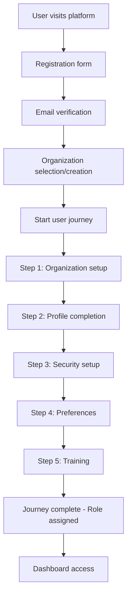
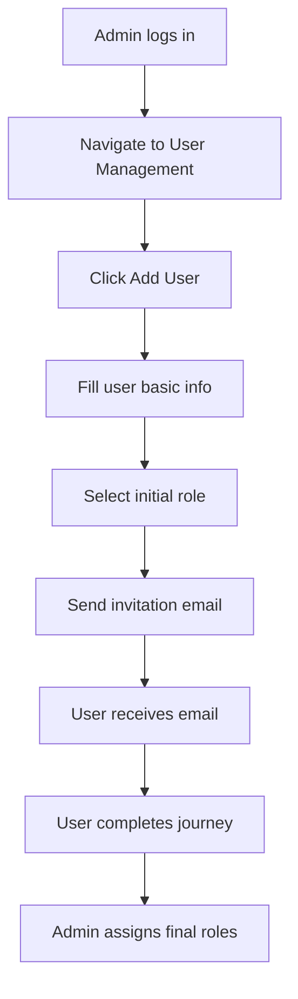
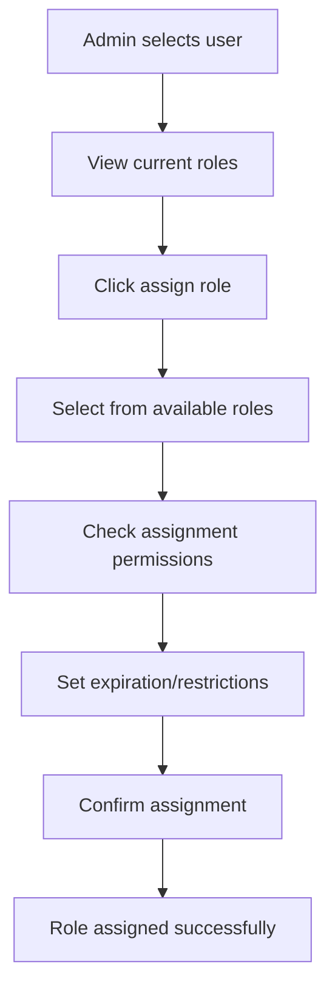

# Role Management & User Journey System Documentation

## Overview

The BlockTrade platform implements a comprehensive multi-level role management system with hierarchical permissions and a guided user onboarding journey. This system supports platform-level administration, organization-specific roles, entity-specific roles, and custom role creation.

## Table of Contents

1. [Role Hierarchy](#role-hierarchy)
2. [User Journey System](#user-journey-system)
3. [API Endpoints](#api-endpoints)
4. [Frontend Integration Guide](#frontend-integration-guide)
5. [User Flow Examples](#user-flow-examples)
6. [Error Handling](#error-handling)
7. [Best Practices](#best-practices)

## Role Hierarchy

### Platform Roles (Highest Level)

These roles have system-wide access across all organizations:

```typescript
interface PlatformRoles {
  platform_super_admin: {
    level: "platform";
    permissions: ["platform:full_access", "platform:*"];
    description: "Complete platform control and administration";
  };
  platform_admin: {
    level: "platform";
    permissions: [
      "platform:user_manage",
      "platform:org_manage",
      "platform:role_manage"
    ];
    description: "Platform administration with limited system access";
  };
  platform_support: {
    level: "platform";
    permissions: ["platform:support", "platform:monitoring"];
    description: "Platform support and monitoring access";
  };
}
```

### Organization Roles (Multi-tenant Level)

These roles operate within specific organizations:

```typescript
interface OrganizationRoles {
  organization_super_admin: {
    level: "organization_super";
    permissions: ["org:full_access", "business:*"];
    description: "Complete organization management";
    canManage: [
      "organization_admin",
      "organization_manager",
      "organization_user",
      "organization_viewer"
    ];
  };
  organization_admin: {
    level: "organization_admin";
    permissions: ["org:user_manage", "org:role_assign", "business:manage"];
    description: "Organization administration and user management";
    canManage: [
      "organization_manager",
      "organization_user",
      "organization_viewer"
    ];
  };
  organization_manager: {
    level: "organization_standard";
    permissions: ["business:approve", "org:user_view", "business:create"];
    description: "Department or team management";
    canManage: ["organization_user", "organization_viewer"];
  };
  organization_user: {
    level: "organization_standard";
    permissions: ["business:create", "business:view", "document:upload"];
    description: "Standard operational user";
  };
  organization_viewer: {
    level: "organization_standard";
    permissions: ["business:view", "document:view"];
    description: "Read-only access for viewing and reporting";
  };
}
```

### Entity-Specific Roles

Customized roles based on organization type (bank, corporate, NBFC, logistics, insurance):

```typescript
interface EntitySpecificRoles {
  bank: {
    bank_admin: [
      "lc:approve",
      "payment:process",
      "kyc:verify",
      "compliance:manage"
    ];
    bank_officer: ["lc:create", "lc:edit", "document:verify", "kyc:view"];
  };
  corporate: {
    corporate_admin: ["lc:create", "document:manage", "trade_finance:manage"];
    corporate_manager: ["lc:approve", "payment:approve"];
  };
  // ... other entity types
}
```

### Role Assignment Rules

```typescript
interface RoleAssignmentRules {
  hierarchy: {
    platform_super_admin: ["*"]; // Can assign any role
    organization_super_admin: ["organization_*", "entity_specific"];
    organization_admin: [
      "organization_manager",
      "organization_user",
      "organization_viewer"
    ];
    organization_manager: ["organization_user", "organization_viewer"];
  };
  restrictions: {
    maxUsersManageable?: number;
    requiresApproval: boolean;
    approverRoles: string[];
  };
}
```

## User Journey System

### Journey Overview

The user onboarding journey consists of 5 progressive steps:

```typescript
interface UserJourneySteps {
  1: "organization_setup"; // Role and department setup
  2: "profile_completion"; // Personal information
  3: "security_setup"; // Password and MFA
  4: "preferences_setup"; // Notifications and preferences
  5: "training_completion"; // Required training and compliance
}
```

### Step-by-Step Breakdown

#### Step 1: Organization Setup

```typescript
interface Step1Data {
  organizationRole: "admin" | "manager" | "user" | "viewer";
  department: string;
  reportingManager?: string;
  teamMembers?: string[];
  projectAssignments?: string[];
}
```

**Frontend Implementation:**

```javascript
// Organization role selection
const roleOptions = [
  {
    value: "admin",
    label: "Administrator",
    description: "Full organization management",
  },
  {
    value: "manager",
    label: "Manager",
    description: "Team and project management",
  },
  { value: "user", label: "User", description: "Standard operations" },
  { value: "viewer", label: "Viewer", description: "Read-only access" },
];

// Department selection (dynamic based on organization)
const departments = await fetchDepartments(organizationId);
```

#### Step 2: Profile Completion

```typescript
interface Step2Data {
  firstName: string;
  lastName: string;
  email: string;
  phone: string;
  bio?: string;
  profilePicture?: string;
  timezone?: string;
  language?: string;
}
```

**Frontend Implementation:**

```javascript
// Profile form with validation
const profileValidation = {
  email: /^[^\s@]+@[^\s@]+\.[^\s@]+$/,
  phone: /^\+?[\d\s-()]+$/,
  required: ["firstName", "lastName", "email", "phone"],
};
```

#### Step 3: Security Setup

```typescript
interface Step3Data {
  passwordConfirmed: boolean;
  securityQuestions: Array<{
    question: string;
    answer: string;
  }>;
  mfaEnabled?: boolean;
  backupEmail?: string;
}
```

#### Step 4: Preferences Setup

```typescript
interface Step4Data {
  notifications: {
    email: boolean;
    sms: boolean;
    push: boolean;
    marketing: boolean;
  };
  theme?: "light" | "dark" | "auto";
  language?: string;
  timezone?: string;
}
```

#### Step 5: Training Completion

```typescript
interface Step5Data {
  trainingModulesCompleted: string[];
  complianceAcknowledgment: boolean;
  additionalTraining?: string[];
}
```

## API Endpoints

### Role Management

#### Create Role

```http
POST /api/roles
Content-Type: application/json
Authorization: Bearer <token>

{
  "name": "custom_analyst",
  "displayName": "Financial Analyst",
  "description": "Specialized role for financial analysis",
  "level": "entity_specific",
  "category": "specialist",
  "permissions": ["lc:view", "report:create", "analytics:view"],
  "organizationId": "org_123",
  "entityType": "bank"
}
```

#### Get Roles

```http
GET /api/roles?organizationId=org_123&level=organization_standard&includeSystem=true
Authorization: Bearer <token>
```

#### Assign Role

```http
POST /api/roles/assign
Content-Type: application/json
Authorization: Bearer <token>

{
  "userId": "user_456",
  "roleId": "role_789",
  "organizationId": "org_123",
  "expiresAt": "2024-12-31T23:59:59Z",
  "isTemporary": false,
  "metadata": {
    "assignmentReason": "Department transfer",
    "notes": "Temporary assignment for project"
  }
}
```

### User Journey

#### Start Journey

```http
POST /api/roles/journey/start
Content-Type: application/json
Authorization: Bearer <token>

{
  "targetUserId": "user_456",
  "organizationType": "bank"
}
```

#### Get Journey Status

```http
GET /api/roles/journey/user_456
Authorization: Bearer <token>
```

#### Complete Step

```http
POST /api/roles/journey/step/1
Content-Type: application/json
Authorization: Bearer <token>

{
  "stepData": {
    "organizationRole": "manager",
    "department": "Trade Finance",
    "reportingManager": "john.doe@bank.com"
  }
}
```

## Frontend Integration Guide

### 1. Authentication & Authorization

```javascript
// Check if user has permission
const hasPermission = async (permission) => {
  try {
    const response = await fetch("/api/auth/permissions", {
      headers: { Authorization: `Bearer ${token}` },
    });
    const { permissions } = await response.json();
    return permissions.includes(permission);
  } catch (error) {
    console.error("Error checking permission:", error);
    return false;
  }
};

// Usage in components
const canCreateRole = await hasPermission("org:role_create");
```

### 2. Role Management UI

```jsx
// Role Management Component
import React, { useState, useEffect } from "react";

const RoleManagement = () => {
  const [roles, setRoles] = useState([]);
  const [loading, setLoading] = useState(true);
  const [canCreateRole, setCanCreateRole] = useState(false);

  useEffect(() => {
    fetchRoles();
    checkPermissions();
  }, []);

  const fetchRoles = async () => {
    try {
      const response = await fetch("/api/roles", {
        headers: { Authorization: `Bearer ${token}` },
      });
      const data = await response.json();
      setRoles(data.data.roles);
    } catch (error) {
      console.error("Error fetching roles:", error);
    } finally {
      setLoading(false);
    }
  };

  const checkPermissions = async () => {
    const canCreate = await hasPermission("org:role_create");
    setCanCreateRole(canCreate);
  };

  return (
    <div>
      <h2>Role Management</h2>
      {canCreateRole && (
        <button onClick={() => setShowCreateModal(true)}>
          Create New Role
        </button>
      )}
      {/* Role list and management UI */}
    </div>
  );
};
```

### 3. User Journey Implementation

```jsx
// User Journey Component
const UserJourney = ({ userId }) => {
  const [journeyState, setJourneyState] = useState(null);
  const [currentStepData, setCurrentStepData] = useState({});

  useEffect(() => {
    fetchJourneyStatus();
  }, [userId]);

  const fetchJourneyStatus = async () => {
    try {
      const response = await fetch(`/api/roles/journey/${userId}`, {
        headers: { Authorization: `Bearer ${token}` },
      });
      const data = await response.json();
      setJourneyState(data.data.onboardingState);
    } catch (error) {
      console.error("Error fetching journey status:", error);
    }
  };

  const completeStep = async (stepNumber, stepData) => {
    try {
      const response = await fetch(`/api/roles/journey/step/${stepNumber}`, {
        method: "POST",
        headers: {
          "Content-Type": "application/json",
          Authorization: `Bearer ${token}`,
        },
        body: JSON.stringify({ stepData }),
      });

      if (response.ok) {
        await fetchJourneyStatus(); // Refresh journey state
        return true;
      }
    } catch (error) {
      console.error("Error completing step:", error);
    }
    return false;
  };

  const renderStep = () => {
    if (!journeyState) return null;

    switch (journeyState.currentStep) {
      case 1:
        return <OrganizationSetupStep onComplete={completeStep} />;
      case 2:
        return <ProfileCompletionStep onComplete={completeStep} />;
      case 3:
        return <SecuritySetupStep onComplete={completeStep} />;
      case 4:
        return <PreferencesSetupStep onComplete={completeStep} />;
      case 5:
        return <TrainingCompletionStep onComplete={completeStep} />;
      default:
        return <div>Journey completed!</div>;
    }
  };

  return (
    <div className="user-journey">
      <div className="journey-progress">
        <div className="steps">
          {[1, 2, 3, 4, 5].map((step) => (
            <div
              key={step}
              className={`step ${
                step <= journeyState?.currentStep ? "active" : ""
              }`}
            >
              Step {step}
            </div>
          ))}
        </div>
      </div>
      {renderStep()}
    </div>
  );
};
```

### 4. Step Components

```jsx
// Organization Setup Step
const OrganizationSetupStep = ({ onComplete }) => {
  const [formData, setFormData] = useState({
    organizationRole: "",
    department: "",
    reportingManager: "",
  });

  const handleSubmit = async (e) => {
    e.preventDefault();
    const success = await onComplete(1, formData);
    if (success) {
      // Handle success (e.g., show success message)
    }
  };

  return (
    <form onSubmit={handleSubmit}>
      <div className="form-group">
        <label>Organization Role</label>
        <select
          value={formData.organizationRole}
          onChange={(e) =>
            setFormData({ ...formData, organizationRole: e.target.value })
          }
          required
        >
          <option value="">Select Role</option>
          <option value="admin">Administrator</option>
          <option value="manager">Manager</option>
          <option value="user">User</option>
          <option value="viewer">Viewer</option>
        </select>
      </div>

      <div className="form-group">
        <label>Department</label>
        <input
          type="text"
          value={formData.department}
          onChange={(e) =>
            setFormData({ ...formData, department: e.target.value })
          }
          required
        />
      </div>

      <button type="submit">Continue</button>
    </form>
  );
};
```

## User Flow Examples

### 1. First-time User Registration Flow



### 2. Admin Adding New User Flow



### 3. Role Assignment Flow



## Error Handling

### Common Error Scenarios

```javascript
// Error handling patterns
const handleApiError = (error, response) => {
  switch (response.status) {
    case 400:
      return "Invalid request data";
    case 401:
      return "Authentication required";
    case 403:
      return "Insufficient permissions";
    case 404:
      return "Resource not found";
    case 409:
      return "Role already assigned";
    case 422:
      return "Validation failed";
    default:
      return "An unexpected error occurred";
  }
};

// Usage in API calls
try {
  const response = await fetch("/api/roles/assign", {
    method: "POST",
    headers: {
      "Content-Type": "application/json",
      Authorization: `Bearer ${token}`,
    },
    body: JSON.stringify(assignmentData),
  });

  if (!response.ok) {
    const errorMessage = handleApiError(null, response);
    throw new Error(errorMessage);
  }

  const result = await response.json();
  return result;
} catch (error) {
  console.error("Assignment failed:", error.message);
  // Show user-friendly error message
}
```

### Validation Errors

```javascript
// Field validation
const validateStepData = (stepNumber, data) => {
  const validators = {
    1: validateStep1,
    2: validateStep2,
    3: validateStep3,
    4: validateStep4,
    5: validateStep5,
  };

  const validator = validators[stepNumber];
  return validator ? validator(data) : { isValid: true };
};

const validateStep1 = (data) => {
  const errors = {};

  if (!data.organizationRole) {
    errors.organizationRole = "Organization role is required";
  }

  if (!data.department) {
    errors.department = "Department is required";
  }

  return {
    isValid: Object.keys(errors).length === 0,
    errors,
  };
};
```

## Best Practices

### 1. Security Considerations

- Always validate permissions on both frontend and backend
- Use JWT tokens with appropriate expiration times
- Implement proper CSRF protection
- Validate all user inputs
- Use HTTPS for all API communications

### 2. UX Best Practices

- Show clear role descriptions and permissions
- Provide progress indicators for user journey
- Use confirmation dialogs for destructive actions
- Show loading states during API calls
- Provide clear error messages and recovery options

### 3. Performance Optimization

- Cache role and permission data appropriately
- Use pagination for large role lists
- Implement proper loading states
- Optimize API calls with proper batching

### 4. Accessibility

- Use proper ARIA labels
- Ensure keyboard navigation works
- Provide sufficient color contrast
- Use semantic HTML elements

## Implementation Checklist

### For Frontend Developers

- [ ] Implement authentication context
- [ ] Create role management components
- [ ] Build user journey flow
- [ ] Add permission checking utilities
- [ ] Implement error handling
- [ ] Add loading states
- [ ] Create form validations
- [ ] Test all user flows
- [ ] Add accessibility features
- [ ] Optimize performance

### API Integration Testing

```javascript
// Test role assignment
const testRoleAssignment = async () => {
  try {
    // Test successful assignment
    const assignment = await assignRole({
      userId: "test_user",
      roleId: "organization_manager",
      organizationId: "test_org",
    });
    console.log("✅ Role assignment successful:", assignment);

    // Test permission check
    const hasPermission = await checkUserPermission("test_user", "lc:create");
    console.log("✅ Permission check:", hasPermission);

    // Test role revocation
    const revocation = await revokeRole(
      "test_user",
      "organization_manager",
      "test_org"
    );
    console.log("✅ Role revocation successful:", revocation);
  } catch (error) {
    console.error("❌ Test failed:", error);
  }
};
```

This documentation provides a comprehensive guide for frontend developers to implement the role management and user journey system. The examples show practical implementation patterns, error handling strategies, and best practices for building a robust user interface.
